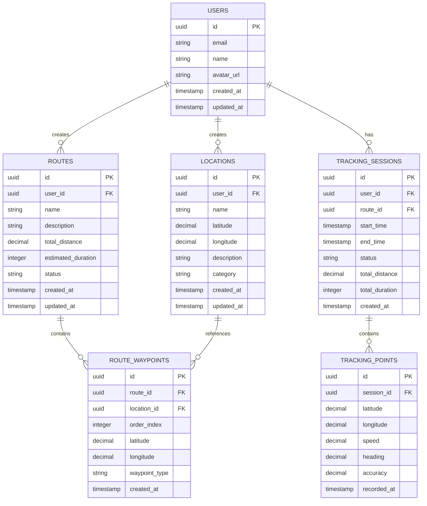

# Arquitectura Técnica - Sistema GPS DashTail

## 1. Diseño de Arquitectura

```mermaid
graph TD
    A[Navegador del Usuario] --> B[Aplicación React Frontend]
    B --> C[SDK de Supabase]
    B --> D[APIs de Mapas Externas]
    C --> E[Servicio Supabase]
    
    subgraph "Capa Frontend"
        B
        F[Componentes GPS]
        G[Gestión de Estado Zustand]
        H[Leaflet Maps]
    end
    
    subgraph "Capa de Servicios (Supabase)"
        E
        I[Base de Datos PostgreSQL]
        J[Autenticación]
        K[Almacenamiento en Tiempo Real]
    end
    
    subgraph "Servicios Externos"
        D
        L[API de Geolocalización]
        M[Servicios de Mapas]
    end
end
```

## 2. Descripción de Tecnologías

* **Frontend**: React\@18 + TypeScript + Tailwind CSS + Vite

* **Backend**: Supabase (PostgreSQL + Auth + Realtime)

* **Mapas**: Leaflet + React-Leaflet

* **Estado**: Zustand

* **UI**: Radix UI + Tailwind CSS

* **Autenticación**: Supabase Auth

* **Base de Datos**: Supabase PostgreSQL

## 3. Definiciones de Rutas

| Ruta             | Propósito                                 |
| ---------------- | ----------------------------------------- |
| `/dashboard`     | Dashboard principal con resumen GPS       |
| `/gps/map`       | Vista principal del mapa interactivo      |
| `/gps/tracking`  | Seguimiento en tiempo real de ubicaciones |
| `/gps/routes`    | Gestión y planificación de rutas          |
| `/gps/locations` | Administración de ubicaciones guardadas   |
| `/gps/settings`  | Configuración del sistema GPS             |
| `/auth/login`    | Página de inicio de sesión                |
| `/auth/register` | Página de registro de usuarios            |

## 4. Definiciones de API

### 4.1 API Principal

**Autenticación de usuarios**

```
POST /api/auth/login
```

Request:

| Nombre Param | Tipo Param | Requerido | Descripción            |
| ------------ | ---------- | --------- | ---------------------- |
| email        | string     | true      | Email del usuario      |
| password     | string     | true      | Contraseña del usuario |

Response:

| Nombre Param | Tipo Param | Descripción                   |
| ------------ | ---------- | ----------------------------- |
| success      | boolean    | Estado de la respuesta        |
| user         | User       | Datos del usuario autenticado |
| token        | string     | Token de sesión               |

Ejemplo:

```json
{
  "email": "usuario@ejemplo.com",
  "password": "password123"
}
```

**Gestión de ubicaciones**

```
GET /api/gps/locations
POST /api/gps/locations
PUT /api/gps/locations/:id
DELETE /api/gps/locations/:id
```

Request POST:

| Nombre Param | Tipo Param | Requerido | Descripción            |
| ------------ | ---------- | --------- | ---------------------- |
| name         | string     | true      | Nombre de la ubicación |
| latitude     | number     | true      | Latitud                |
| longitude    | number     | true      | Longitud               |
| description  | string     | false     | Descripción opcional   |
| category     | string     | false     | Categoría de ubicación |

**Gestión de rutas**

```
GET /api/gps/routes
POST /api/gps/routes
PUT /api/gps/routes/:id
DELETE /api/gps/routes/:id
```

Request POST:

| Nombre Param | Tipo Param  | Requerido | Descripción       |
| ------------ | ----------- | --------- | ----------------- |
| name         | string      | true      | Nombre de la ruta |
| waypoints    | Waypoint\[] | true      | Puntos de la ruta |
| distance     | number      | false     | Distancia total   |
| duration     | number      | false     | Duración estimada |

**Seguimiento en tiempo real**

```
GET /api/gps/tracking/:userId
POST /api/gps/tracking/start
POST /api/gps/tracking/stop
POST /api/gps/tracking/update
```

Request POST /api/gps/tracking/update:

| Nombre Param | Tipo Param | Requerido | Descripción      |
| ------------ | ---------- | --------- | ---------------- |
| latitude     | number     | true      | Latitud actual   |
| longitude    | number     | true      | Longitud actual  |
| timestamp    | string     | true      | Marca de tiempo  |
| speed        | number     | false     | Velocidad actual |
| heading      | number     | false     | Dirección        |

## 5. Diagrama de Arquitectura del Servidor

```mermaid
graph TD
    A[Cliente / Frontend] --> B[Capa de Controladores]
    B --> C[Capa de Servicios]
    C --> D[Capa de Repositorio]
    D --> E[(Supabase PostgreSQL)]
    
    subgraph Servidor
        B
        C
        D
        F[Servicios de Geolocalización]
        G[Servicios de Mapas]
        H[Servicios de Rutas]
    end
    
    C --> F
    C --> G
    C --> H
end
```

## 6. Modelo de Datos

### 6.1 Definición del Modelo de Datos



### 6.2 Lenguaje de Definición de Datos

**Tabla de Usuarios (users)**

```sql
-- Crear tabla de usuarios
CREATE TABLE users (
    id UUID PRIMARY KEY DEFAULT gen_random_uuid(),
    email VARCHAR(255) UNIQUE NOT NULL,
    name VARCHAR(100) NOT NULL,
    avatar_url TEXT,
    created_at TIMESTAMP WITH TIME ZONE DEFAULT NOW(),
    updated_at TIMESTAMP WITH TIME ZONE DEFAULT NOW()
);

-- Crear índices
CREATE INDEX idx_users_email ON users(email);
CREATE INDEX idx_users_created_at ON users(created_at DESC);
```

**Tabla de Ubicaciones (locations)**

```sql
-- Crear tabla de ubicaciones
CREATE TABLE locations (
    id UUID PRIMARY KEY DEFAULT gen_random_uuid(),
    user_id UUID REFERENCES users(id) ON DELETE CASCADE,
    name VARCHAR(255) NOT NULL,
    latitude DECIMAL(10, 8) NOT NULL,
    longitude DECIMAL(11, 8) NOT NULL,
    description TEXT,
    category VARCHAR(50) DEFAULT 'general',
    created_at TIMESTAMP WITH TIME ZONE DEFAULT NOW(),
    updated_at TIMESTAMP WITH TIME ZONE DEFAULT NOW()
);

-- Crear índices
CREATE INDEX idx_locations_user_id ON locations(user_id);
CREATE INDEX idx_locations_category ON locations(category);
CREATE INDEX idx_locations_coordinates ON locations(latitude, longitude);
```

**Tabla de Rutas (routes)**

```sql
-- Crear tabla de rutas
CREATE TABLE routes (
    id UUID PRIMARY KEY DEFAULT gen_random_uuid(),
    user_id UUID REFERENCES users(id) ON DELETE CASCADE,
    name VARCHAR(255) NOT NULL,
    description TEXT,
    total_distance DECIMAL(10, 2),
    estimated_duration INTEGER,
    status VARCHAR(20) DEFAULT 'draft' CHECK (status IN ('draft', 'active', 'completed', 'archived')),
    created_at TIMESTAMP WITH TIME ZONE DEFAULT NOW(),
    updated_at TIMESTAMP WITH TIME ZONE DEFAULT NOW()
);

-- Crear índices
CREATE INDEX idx_routes_user_id ON routes(user_id);
CREATE INDEX idx_routes_status ON routes(status);
CREATE INDEX idx_routes_created_at ON routes(created_at DESC);
```

**Tabla de Puntos de Ruta (route\_waypoints)**

```sql
-- Crear tabla de puntos de ruta
CREATE TABLE route_waypoints (
    id UUID PRIMARY KEY DEFAULT gen_random_uuid(),
    route_id UUID REFERENCES routes(id) ON DELETE CASCADE,
    location_id UUID REFERENCES locations(id) ON DELETE SET NULL,
    order_index INTEGER NOT NULL,
    latitude DECIMAL(10, 8) NOT NULL,
    longitude DECIMAL(11, 8) NOT NULL,
    waypoint_type VARCHAR(20) DEFAULT 'waypoint' CHECK (waypoint_type IN ('start', 'waypoint', 'end')),
    created_at TIMESTAMP WITH TIME ZONE DEFAULT NOW()
);

-- Crear índices
CREATE INDEX idx_route_waypoints_route_id ON route_waypoints(route_id);
CREATE INDEX idx_route_waypoints_order ON route_waypoints(route_id, order_index);
```

**Tabla de Sesiones de Seguimiento (tracking\_sessions)**

```sql
-- Crear tabla de sesiones de seguimiento
CREATE TABLE tracking_sessions (
    id UUID PRIMARY KEY DEFAULT gen_random_uuid(),
    user_id UUID REFERENCES users(id) ON DELETE CASCADE,
    route_id UUID REFERENCES routes(id) ON DELETE SET NULL,
    start_time TIMESTAMP WITH TIME ZONE NOT NULL,
    end_time TIMESTAMP WITH TIME ZONE,
    status VARCHAR(20) DEFAULT 'active' CHECK (status IN ('active', 'paused', 'completed', 'cancelled')),
    total_distance DECIMAL(10, 2),
    total_duration INTEGER,
    created_at TIMESTAMP WITH TIME ZONE DEFAULT NOW()
);

-- Crear índices
CREATE INDEX idx_tracking_sessions_user_id ON tracking_sessions(user_id);
CREATE INDEX idx_tracking_sessions_status ON tracking_sessions(status);
CREATE INDEX idx_tracking_sessions_start_time ON tracking_sessions(start_time DESC);
```

**Tabla de Puntos de Seguimiento (tracking\_points)**

```sql
-- Crear tabla de puntos de seguimiento
CREATE TABLE tracking_points (
    id UUID PRIMARY KEY DEFAULT gen_random_uuid(),
    session_id UUID REFERENCES tracking_sessions(id) ON DELETE CASCADE,
    latitude DECIMAL(10, 8) NOT NULL,
    longitude DECIMAL(11, 8) NOT NULL,
    speed DECIMAL(5, 2),
    heading DECIMAL(5, 2),
    accuracy DECIMAL(5, 2),
    recorded_at TIMESTAMP WITH TIME ZONE NOT NULL
);

-- Crear índices
CREATE INDEX idx_tracking_points_session_id ON tracking_points(session_id);
CREATE INDEX idx_tracking_points_recorded_at ON tracking_points(recorded_at DESC);
CREATE INDEX idx_tracking_points_coordinates ON tracking_points(latitude, longitude);
```

**Configuración de Permisos RLS (Row Level Security)**

```sql
-- Habilitar RLS en todas las tablas
ALTER TABLE users ENABLE ROW LEVEL SECURITY;
ALTER TABLE locations ENABLE ROW LEVEL SECURITY;
ALTER TABLE routes ENABLE ROW LEVEL SECURITY;
ALTER TABLE route_waypoints ENABLE ROW LEVEL SECURITY;
ALTER TABLE tracking_sessions ENABLE ROW LEVEL SECURITY;
ALTER TABLE tracking_points ENABLE ROW LEVEL SECURITY;

-- Políticas para usuarios autenticados
CREATE POLICY "Users can view own profile" ON users FOR SELECT USING (auth.uid() = id);
CREATE POLICY "Users can update own profile" ON users FOR UPDATE USING (auth.uid() = id);

CREATE POLICY "Users can manage own locations" ON locations FOR ALL USING (auth.uid() = user_id);
CREATE POLICY "Users can manage own routes" ON routes FOR ALL USING (auth.uid() = user_id);
CREATE POLICY "Users can manage own tracking" ON tracking_sessions FOR ALL USING (auth.uid() = user_id);

-- Permisos para roles
GRANT SELECT ON users TO anon;
GRANT ALL PRIVILEGES ON users TO authenticated;
GRANT ALL PRIVILEGES ON locations TO authenticated;
GRANT ALL PRIVILEGES ON routes TO authenticated;
GRANT ALL PRIVILEGES ON route_waypoints TO authenticated;
GRANT ALL PRIVILEGES ON tracking_sessions TO authenticated;
GRANT ALL PRIVILEGES ON tracking_points TO authenticated;
```

**Datos Iniciales**

```sql
-- Insertar categorías de ubicaciones por defecto
INSERT INTO locations (user_id, name, latitude, longitude, category, description)
VALUES 
  -- Estos serán insertados por cada usuario individualmente
  -- Ejemplo de estructura para referencia
  (auth.uid(), 'Casa', 40.7128, -74.0060, 'home', 'Ubicación de casa'),
  (auth.uid(), 'Oficina', 40.7589, -73.9851, 'work', 'Ubicación de trabajo');
```

