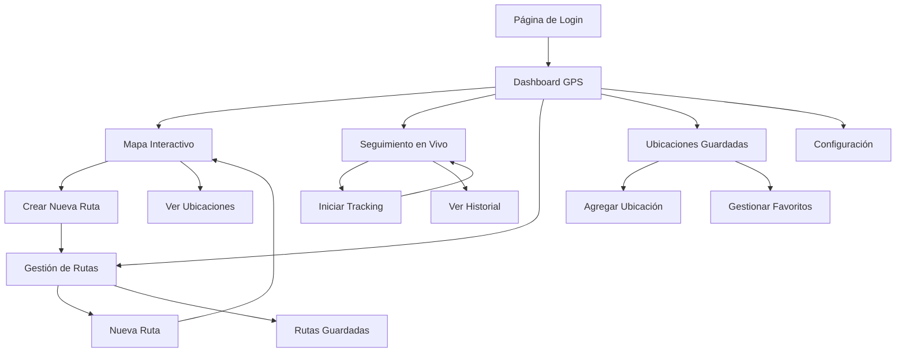

# Documento de Requerimientos del Producto - Sistema GPS DashTail

## 1. Resumen del Producto

Sistema GPS integral construido sobre la base del template DashTail, diseñado para proporcionar funcionalidades completas de navegación, seguimiento de ubicación y gestión de rutas. El sistema permite a los usuarios planificar rutas, realizar seguimiento en tiempo real, gestionar ubicaciones favoritas y acceder a un dashboard completo con métricas de navegación.

El producto está dirigido a usuarios individuales y empresas que necesitan soluciones de navegación y seguimiento GPS, ofreciendo una interfaz moderna y funcionalidades avanzadas de geolocalización.

## 2. Características Principales

### 2.1 Roles de Usuario

| Rol | Método de Registro | Permisos Principales |
|-----|-------------------|---------------------|
| Usuario Básico | Registro por email | Puede usar funciones básicas de navegación, guardar hasta 10 ubicaciones, crear rutas simples |
| Usuario Premium | Upgrade por suscripción | Ubicaciones ilimitadas, seguimiento avanzado, historial completo, exportación de datos |
| Administrador | Acceso por invitación | Gestión completa del sistema, análisis de usuarios, configuración global |

### 2.2 Módulos de Funcionalidad

Nuestro sistema GPS consta de las siguientes páginas principales:

1. **Dashboard GPS**: panel de control principal, estadísticas de uso, accesos rápidos, actividad reciente
2. **Mapa Interactivo**: visualización de mapas en tiempo real, marcadores de ubicación, controles de navegación, capas de información
3. **Seguimiento en Vivo**: tracking en tiempo real, historial de movimientos, alertas de ubicación, compartir ubicación
4. **Gestión de Rutas**: creación y edición de rutas, optimización automática, guardado de rutas favoritas, cálculo de distancias
5. **Ubicaciones Guardadas**: gestión de lugares favoritos, categorización de ubicaciones, importación/exportación, búsqueda avanzada
6. **Configuración**: preferencias de usuario, configuración de mapas, notificaciones, privacidad

### 2.3 Detalles de Páginas

| Nombre de Página | Nombre del Módulo | Descripción de Funcionalidad |
|------------------|-------------------|------------------------------|
| Dashboard GPS | Panel de Estadísticas | Mostrar métricas de uso diario/semanal/mensual, distancia recorrida, tiempo de navegación, rutas completadas |
| Dashboard GPS | Accesos Rápidos | Botones para iniciar navegación rápida, crear nueva ruta, ver ubicación actual, acceder a favoritos |
| Dashboard GPS | Actividad Reciente | Lista de rutas recientes, ubicaciones visitadas, sesiones de seguimiento completadas |
| Mapa Interactivo | Visualización Principal | Renderizar mapa con Leaflet, mostrar ubicación actual, zoom y pan, cambio de capas de mapa |
| Mapa Interactivo | Marcadores y POI | Mostrar ubicaciones guardadas, puntos de interés, marcadores personalizados, popups informativos |
| Mapa Interactivo | Controles de Navegación | Botones de zoom, centrar en ubicación, búsqueda de direcciones, medición de distancias |
| Seguimiento en Vivo | Tracking Activo | Iniciar/pausar/detener seguimiento, mostrar ruta en tiempo real, velocidad actual, tiempo transcurrido |
| Seguimiento en Vivo | Historial de Movimientos | Ver sesiones anteriores, reproducir rutas, exportar datos GPX/KML, estadísticas de sesión |
| Seguimiento en Vivo | Alertas y Notificaciones | Configurar geofences, alertas de velocidad, notificaciones de llegada, compartir ubicación |
| Gestión de Rutas | Creador de Rutas | Crear rutas arrastrando puntos, agregar waypoints, calcular distancia y tiempo, vista previa 3D |
| Gestión de Rutas | Optimización | Optimizar ruta automáticamente, evitar tráfico, rutas alternativas, preferencias de transporte |
| Gestión de Rutas | Biblioteca de Rutas | Guardar rutas favoritas, organizar por categorías, compartir rutas, importar rutas externas |
| Ubicaciones Guardadas | Gestión de Favoritos | Agregar/editar/eliminar ubicaciones, asignar categorías, agregar notas y fotos |
| Ubicaciones Guardadas | Búsqueda y Filtros | Buscar por nombre/categoría, filtros avanzados, ordenamiento, vista de lista/mapa |
| Ubicaciones Guardadas | Importación/Exportación | Importar desde Google Maps, exportar a diferentes formatos, sincronización con servicios externos |
| Configuración | Preferencias de Usuario | Configurar unidades de medida, idioma, tema, información personal |
| Configuración | Configuración de Mapas | Seleccionar proveedor de mapas, estilo de mapa, capas visibles, configuración offline |
| Configuración | Privacidad y Seguridad | Configurar compartir ubicación, historial de datos, permisos de aplicación, autenticación |

## 3. Proceso Principal

### Flujo de Usuario Básico

1. **Registro/Login**: El usuario se registra o inicia sesión en el sistema
2. **Dashboard**: Accede al panel principal con resumen de actividad
3. **Navegación**: Puede elegir entre crear nueva ruta, usar ubicación guardada o iniciar seguimiento libre
4. **Uso del Mapa**: Interactúa con el mapa para planificar rutas o ver ubicaciones
5. **Seguimiento**: Inicia sesión de seguimiento para registrar movimientos
6. **Gestión**: Guarda ubicaciones importantes y organiza rutas favoritas

### Flujo de Usuario Premium

1. **Acceso Completo**: Todas las funcionalidades básicas sin limitaciones
2. **Análisis Avanzado**: Acceso a estadísticas detalladas y reportes
3. **Exportación**: Puede exportar datos en múltiples formatos
4. **Sincronización**: Sincroniza datos con servicios externos
5. **Soporte Prioritario**: Acceso a funcionalidades beta y soporte técnico

## 4. Diseño de Interfaz de Usuario

### 4.1 Estilo de Diseño

**Colores Principales:**
- Primario: #3B82F6 (Azul GPS)
- Secundario: #10B981 (Verde Éxito)
- Acento: #F59E0B (Amarillo Alerta)
- Fondo: #F8FAFC (Gris Claro)
- Texto: #1F2937 (Gris Oscuro)

**Estilo de Botones:**
- Botones redondeados con radio de 8px
- Efectos de hover suaves
- Iconos integrados con Heroicons
- Estados activo/inactivo claramente diferenciados

**Tipografía:**
- Fuente principal: Inter (sans-serif)
- Tamaños: 12px (pequeño), 14px (normal), 16px (mediano), 20px (títulos), 24px (encabezados)
- Peso: 400 (normal), 500 (medio), 600 (semi-bold), 700 (bold)

**Estilo de Layout:**
- Diseño basado en cards con sombras suaves
- Navegación lateral fija con iconos
- Header superior con breadcrumbs
- Grid responsivo con Tailwind CSS

**Iconos y Emojis:**
- Heroicons para iconos de interfaz
- Iconos de mapa personalizados para marcadores
- Emojis para categorías de ubicaciones (🏠 Casa, 🏢 Trabajo, ⭐ Favorito)

### 4.2 Resumen de Diseño de Páginas

| Nombre de Página | Nombre del Módulo | Elementos de UI |
|------------------|-------------------|----------------|
| Dashboard GPS | Panel de Estadísticas | Cards con métricas, gráficos de línea para tendencias, colores #3B82F6 y #10B981, fuente Inter 16px |
| Dashboard GPS | Accesos Rápidos | Botones grandes con iconos, grid 2x2, hover effects, colores primarios con gradientes suaves |
| Mapa Interactivo | Visualización Principal | Mapa full-screen, controles flotantes, tema claro/oscuro, marcadores personalizados azules |
| Mapa Interactivo | Controles de Navegación | Botones circulares flotantes, posición fija esquina superior derecha, iconos blancos sobre fondo semi-transparente |
| Seguimiento en Vivo | Tracking Activo | Panel de estado con métricas en tiempo real, botón de acción principal grande, colores de estado (verde=activo, rojo=detenido) |
| Seguimiento en Vivo | Historial | Lista con cards de sesiones, filtros en sidebar, timeline visual, colores neutros con acentos azules |
| Gestión de Rutas | Creador de Rutas | Sidebar con herramientas, mapa principal, panel inferior con detalles, drag & drop visual |
| Gestión de Rutas | Biblioteca | Grid de cards de rutas, vista lista alternativa, filtros superiores, búsqueda prominente |
| Ubicaciones Guardadas | Lista de Favoritos | Cards con imágenes, categorías con colores, acciones rápidas, layout masonry responsivo |
| Configuración | Formularios | Formularios limpios con labels flotantes, switches para toggles, secciones bien separadas |

### 4.3 Responsividad

El producto está diseñado con enfoque mobile-first y adaptación completa para desktop:

**Breakpoints:**
- Mobile: 320px - 768px
- Tablet: 768px - 1024px  
- Desktop: 1024px+

**Adaptaciones Móviles:**
- Navegación inferior en lugar de sidebar
- Controles de mapa optimizados para touch
- Cards apiladas verticalmente
- Botones más grandes para mejor usabilidad táctil
- Menús colapsables para ahorrar espacio

**Optimizaciones Touch:**
- Área mínima de toque de 44px
- Gestos de swipe para navegación
- Zoom y pan optimizados en mapas
- Feedback haptic donde sea posible
- Prevención de zoom accidental

**Funcionalidades Offline:**
- Cache de mapas para áreas frecuentes
- Sincronización automática cuando hay conexión
- Indicadores claros de estado de conectividad
- Funcionalidad básica disponible sin internet

---

**Nota**: Este documento de requerimientos sirve como guía completa para el desarrollo del sistema GPS, definiendo todas las funcionalidades esenciales y el diseño de interfaz necesario para crear una experiencia de usuario excepcional.